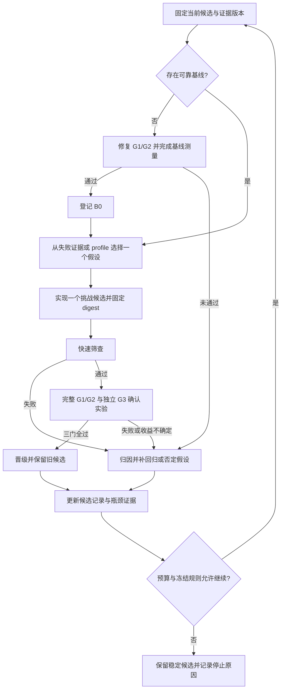

# T3 Championship Path and Submission Readiness

The simulator has passed the available public correctness checks, but it has no
official score and one large public example remains unverified. Keep the exact CPU
simulator and qualify a dependable submission first. Test faster candidates against
it on the same machine, including scenarios not used to tune them, and keep only
reproducible improvements. The final score averages the rates of all evaluation
units. Submit to Development as soon as a qualified candidate and the platform are
available; further optimization must not delay that feedback. An organizer-side
repeat-check defect still blocks Final readiness, but must not prevent us from
freezing our own candidate. This plan records the review on 15 September 2026;
implementation, infrastructure and competition submissions remain future work.
The internal iteration loop has three gates: a verifiable submission package,
complete local correctness and resource evidence, and a measured improvement over
the current stable candidate. Each attempt either promotes a proven candidate or
produces evidence that determines the next repair or experiment.

## 决策与目标

**夺冠主线：尽早取得一份可靠候选与平台反馈，在完整语义守住的前提下提高可复现的
全评测集成绩。** CPU 精确仿真继续作为技术主线；交付、测量和官方动态核查分别推进。
仅凭两个场景的最高速度，无法判断冠军竞争力；尚无可核实的对手成绩可据以估计胜率。

当前最有价值的下一步是消除三个不确定性：**镜像能否按新契约被接收、最大公开负载能否
在资源限制内完成、官方计时边界内时间花在哪里**。它们决定下一次优化能否真正得分。
先保存既有候选 digest 及证据，升级和优化均生成新的可比较候选，不覆盖已验证工件。

本文是本 fork 的执行计划；官方规则仍以文末来源为准。它取代本文件旧版的
“等待官方分配 C5 ID”流程和 fast_sim README 的“Remaining 10× path”。
跨赛道资源分配不在本次调整范围内。

## 9 月 15 日核查：哪些变化影响我们

| 官方信息与时间 | 当前判断 | 对计划的影响 |
| --- | --- | --- |
| Track 3 `main@b3e2639`，最后提交 9/12；相对 fork 尚有 34 个上游提交、27 个文件变化 | 已 fetch 并固定 SHA；三方合并预演无文本冲突，尚未执行合并或语义验收 | P0 在隔离分支对齐评分器、文档及新增契约检查 |
| Hub `v2.4.1` 已发布，指向 `fbc57d2`；9/12 changelog [S1] | 可安装的正式 tag，支持 `models: []` 与 team-claim 2.0 | 打包环境升到 2.4.1，删除虚构模型声明 |
| Track 3 当前 CI/README 仍 pin `v2.4.0` [S2] | 与 Hub 最新引导存在发布滞后；scorer 版本为 `3.1.0`，不是 toolkit 版本 | 分别记录 toolkit tag/commit、scorer SHA/version；保留官方 pin 对照测试后再切换，不能只看 `pip show` |
| 身份流程改为工具派生，无注册映射页面 [S3] | `team_id` 由网站队号和 Team Key 派生；首次上传需两文件 ZIP | 用官方 `submission pack`；旧单文件 ZIP 与人工填写身份流程退役 |
| 官方 9/11 明确回复：四赛道 CodaBench 尚未发布，无开放日期 [S4] | 9/15 查看公开官网首页及 Compete 页未发现 T3 提交链接；T3 空榜标注生成于 9/11 07:03 UTC | “Development is Open”横幅不等于提交可用；继续完成本地工作，开放时取 submission ID 与平台反馈 |
| 9/11 确认、9/12 代码仍保留的 repeat-digest 缺陷 [S5] | 整个输出树哈希包含真实计时 sidecar；验收测试仍 `xfail(strict=True)`，命名 stable/volatile 文件集合不等于修复 | 如实报告计时；把官方生产摘要修复列为 Final 外部阻塞，不在参赛镜像伪造常量规避 |
| 9/4 官方答复，9/12 文档更正：全 roster 算术平均 [S6] | 各单元 rate 来自合格重复运行的中位数；最后对所有单元 rate 求均值 | 撤销“只冲两个吞吐场景/固定百万阈值”的目标，按全 roster 分数增量选优化 |
| 官方无同机 ABIDES 重测、正式路径省略 speedup 等次级诊断 [S6] | 旧约 65k 基准已撤回；历史参考硬件不明；GPU 奖项本地计算不证明官方奖项测量已上线 | 历史“37–48×”不作为领先证据；GPU 和奖项支线待完整测量、实际奖项规则再评估 |

网站身份 `chilli` / 网站队号 `23` / CodaBench 账号 `chilli` 来自 9/8 的既有核验；
本轮没有重新登录核验私有公告、账号状态或邮件。9/15 的公开网页观察不能证明
9/11 后绝无私有通知；在真正上传前重新核对登录后的入口及公告。

## 当前底牌与缺口

代码基线为 fork `origin/main@119930b`，已含提交收尾 PR；原主工作区仍停在
`78f4f7b`。候选镜像由 [candidate.json](../submission/candidate.json) 持有：
`sha256:b7892677fb8c3446a3814ae24a141f2696c006130b6323807a4f34dc48e68d40`。

| 项目 | 已有证据 | 尚不能推出的结论 |
| --- | --- | --- |
| Native C/Cython CPU 路径，四类 agent、RNG、撮合、账本 | Step 13 已实现，Hybrid 回退保留；[实现](../baselines/fast_sim/) | 未测参数组合和发生异常后的回退仍需验证 |
| 公开单场景 | 9/8 回归报告 65/65，0 失败、0 报错 | 不是最新评分器下的重跑，也不是 held-out 通过 |
| Batch 与重复性 | 6/6 batch；as06 与 dense-3 各三次 parquet 字节一致 | 不是所有单元、多 seed 的证明，也不覆盖生产整树摘要问题 |
| 大型 exemplar | 没有公开参考轨迹；此前额外长跑停止，无 verdict | 不能宣称 72/72、全 roster 均值或完整资源通过 |
| 镜像与封包 | 9/8 记录了匿名 registry 可读，镜像固定 digest | 不是今天的可拉取证明；旧封包缺少最新 team claim |
| 正式成绩 | 没有 submission ID 或正式排名证据 | 不能声称领先、冠军速度或正式加速比 |

以上测试结果来自 [validation.json](../submission/validation.json)，其环境是 macOS ARM
运行 amd64 容器，toolkit `v2.3.1@9c5541a`；本轮审阅历史证据，没有重跑模拟器。
本地历史原始报告位于相邻工作目录
`t3-fast-out/verification-20260908/regression/report.json`。

性能证据必须分口径：fast_sim README 的 as06 **531,669** / gb_mega **480,889**
events/sec 是较早本机实验的 best 值。9/8 容器回归报告重新计算的 65 场景
自报均值为 **35,819.02**，其中 as06 **35,225.74**、gb_mega **35,236.16**。
六个 batch 自报约 **2,951–6,674**。这些数值的主机、运行条件和计时边界不一致，
不能据此判定性能回退或相互计算加速比。

代码层面的计时差异已确认：`fast_sim/simulate.py` 的时钟包围 `run_scenario()`，
不含进程导入、parquet 写出与随后哈希；batch 时钟包括子进程启动及子输出写出。
官方 Runner 计时才决定正式分数。因此，序列化、启动及 batch 调度是待测候选瓶颈，
不是已经证明的唯一瓶颈。

## 真正优化的目标

在满足评测计划准入条件的前提下，正式目标覆盖完整评测 roster：

```text
r_i = median_j(第 i 单元第 j 次有效重复的 Runner 事件数 / Runner 耗时)
S   = (r_1 + ... + r_N) / N
```

`N` 来自完整评测计划，不是成功完成的子集。失败单元按 C1 的失败政策处理；若触发
整体不准入，就没有可声称的正式成绩。内部候选必须通过全部适用门禁，不能靠删除失败
单元美化均值。正确性、可执行性与复现性是晋级否决项，不拿它们交换吞吐提升。

重复次数及 warm-up 由 C1 预先规定；当前本地 timer 的“五次、丢第一次、变 seed”
不是已冻结的 Final 承诺。开发计时继续标记 `rankable=false`。同 seed 重复性测试
与不同 seed 的泛化测试分开进行，不能要求不同 seed 输出相同。

本轮机械统计公开卡片：撮合语义 14、agent-mix 11、latency-profile 9、
calibration-stylized-facts 12、exchange-protocol 7、reactive-agent 6、
throughput-scale 13，共 72；其中 65 个单场景、6 个 batch、1 个 exemplar。
六个 batch 在公开集合仅占 6/72；Final 家族占比未知，不外推这个比例。

优化按 **`ΔS = sum(新 r_i - 旧 r_i) / N` 与投入时间**排序。低速单元不会因速度低
获得额外权重；通用启动优化可能覆盖很多单元，batch 专项只改变所覆盖单元。
测量未完成的单元保持“未知”，不得从分母删去后宣称完整分数。

## 内部闭环目标：建立基线、首次晋级、持续增益

内部目标只使用我们能检查的证据。**G1 不要求平台受理或 submission ID**；那是外部
Development 链路。真实队号/密钥和可用主机未就绪时如实标记 blocked，不用假身份或
不匹配的硬件生成通过记录。平台未开放不影响其他内部任务。

| 目标 | 完成条件 | 唯一主要产物 |
| --- | --- | --- |
| **B0：建立可靠基线** | 固定一个镜像，G1/G2 通过，取得完整 72 单元的本地基线分数、测量协议和资源记录；不要求它战胜自己 | 首个稳定候选 B0 与完整证据索引 |
| **B1：跑通一次增益闭环** | 从 B0 产生一个挑战候选，G1/G2/G3 全部通过并晋级；失败实验自动留下原因、回归样本或被否定假设 | 第一次可复现的晋级记录和下一轮有证据的实验选择 |
| **Bn：持续增益** | 每轮只与当前稳定候选比较，满足三个门禁才替换它；同时报告相对 B0 的累计增益 | 可追溯的候选链 `B0 → B1 → … → Bn` |

**B1 是首个端到端增益目标。** 仅把流程跑通但没有可信提升，记为“闭环可运行、增益
目标未完成”；平台期、预算耗尽和到达冻结日分别是停止原因，均不冒充目标达成。

## 三个内部验收门禁

| 门禁 | 必须同时满足 | 失败或缺证据时 |
| --- | --- | --- |
| **G1：可交付** | 精确 digest 的 linux/amd64 镜像匿名可拉取；接口标签正确；两个 verb 离线启动；最新版适用 C5 由官方 parser 验签，`models: []`；正式队号的 team-claim 2.0 绑定 ZIP 内 descriptor；无密钥入包；包内镜像与验证对象一致 | 进入打包/接口修复，保留旧稳定候选；无凭据则仅阻塞真实封包验收，允许独立仿真工作 |
| **G2：可靠运行** | 65 单场景＋6 batch 按固定公开门禁通过；全部 72 单元完整执行且资源合规；无参考 exemplar 的 schema、计数一致性、重复性和资源检查通过，语义结果保留 unknown；预先固定的独立 seed/参数组、边界与回退差分通过；同 seed 重复 parquet 字节一致，计时如实变化 | 定位首个有证据的失败，补最小回归样本并修复；不进入性能晋级 |
| **G3：可信增益** | 完整 72 单元同机配对数据齐全；相对当前稳定候选 `ΔS` 的 95% 区间下界 > 0；没有超出重复波动的 family 退化；G1/G2 证据仍适用 | 可信退化则拒绝；不能区分收益和噪声则记 inconclusive，保持稳定候选 |

这里的 G2 是**公开可验证范围的完整通过**，不是对 exemplar 隐藏参考或 Final 的语义
保证。G1 的离线启动也不能替代 G2 的完整运行。没有实测磁盘/容器总峰值内存记录时，
资源状态必须是 missing，不能仅凭命令写了限额就标 pass。

每轮开始固定验收 roster 和预算：完整公开 72 单元；独立差分组至少每个公开 family
三个新 seed/合法参数变体（七个 family 至少 21 例），另加六类公开 batch 的新 seed
变体；显式覆盖 STP、收盘边界、scheduled jumps、延迟/纳秒精度和 Native 中途异常。
这些是内部最低起点，可按失败证据扩充；不是对未知场景覆盖率的承诺。

## 闭环链路与自动决策



下一步由结果驱动，优先级固定为：**证据缺失/过期 → G1/G2 真实失败 → 未测资源边界
→ profile 支持的性能机会**。有多个性能机会时，比较受影响单元上的可实现 `ΔS` 上限、
实现/验证成本与语义风险，选择一项。模型负责判断假设；工具负责运行、计数、统计和
门禁派生，不能由模型填写 pass 或手改基线分数。

| 结果 | 下一步 | 是否替换稳定候选 |
| --- | --- | --- |
| G1/G2 fail | 最小复现 → 修复 → 快速回归 → 完整验收 | 否 |
| 环境故障、证据 missing/stale/blocked | 修复环境或补测；保留该次记录，不把它当作性能失败 | 否 |
| G3 fail/inconclusive | 保留原始配对数据，否定假设或改选方向；不能反复重测直到显著 | 否 |
| G1/G2/G3 pass | 冻结证据，比较当前基线 digest 未变后晋级；旧基线保留可回退 | 是 |
| 实际运行暴露已晋级版本的问题 | 撤销该版本可用状态，切回仍满足当前契约的最近稳定版本，失败加入回归 | 回退，不覆盖历史 |

同一问题连续三次失败时停止该循环并提交诊断供人工判断，沿用仓库硬纪律；不得换一个
实验名清零。同一候选只执行预先声明的确认实验，诊断性重测不参与晋级。修复产生新
digest 后重新验收。若没有可用稳定候选，状态仍是 B0 未完成，禁止以旧历史通过替代。

## 两个候选与晋级规则

**稳定候选**是当前证据最完整、可重新打包提交的固定镜像；9/8 镜像只是它的起点，
最新契约及 exemplar 缺口补齐前不能标记为完整合格。**挑战候选**每次只验证一个主要
优化假设。Native 与 Hybrid 是镜像内部实现路径，不等同于这两个候选。

挑战候选按 G1/G2/G3 晋级。只在单个热门场景更快、只改善自报时钟、或只在最佳一次
运行更快的变更均不晋级。保留旧候选及其证据，回退通过选择旧 digest 完成。

固定的“总分至少提升 5%”取消。可靠的小收益可以累积；对复杂重写要求更大的收益和
更多验证时间。每个实验开工前写下假设、影响哪些单元、预计耗时、停止条件及回归范围。
默认 **半个工作日定位、一日内决定继续或放弃**；停止无证据的重复微调。
若筛查阶段已读取性能数据来选候选，晋级必须另跑事先固定的确认实验，不重复使用筛查
数据构造区间。报告 `S(Bn)/S(B0)-1` 的累计增益时，用同一当前测量协议重新比较 B0，
不能连乘不同机器/时期的历史增益。

## 实验协议与性能突破口

先为代表性单元做低成本筛查，覆盖每个公开 family、短场景、长场景、异质 batch 和
最大 exemplar；筛查结果不能替代完整评测。候选晋级才运行完整配对测量，节省迭代预算。

- **测量条件**：固定原生 amd64 主机、CPU/内存/磁盘限额及线程数，参赛容器逐个运行；
  固定输入、输出 writer 版本与压缩参数。镜像构建/拉取单独记录，运行时钟覆盖容器命令
  的启动至退出；官方边界公布后调整本地协议，历史数据不混算。profiling 与最终测速分开。
  分子由本地测量工具从实际 parquet footer 读取，分母由宿主记录；拒绝使用参赛容器
  自报 `events_per_sec` 作为 G3 输入，事件数仍须通过适用的语义/参考校验。
- **重复协议**：预先确定顺序及 seed；每个版本先做一次独立预热，再做五组交错 A/B
  配对运行，每次从新容器开始，不能复用预热容器内状态。记录每次实际耗时，不挑最好值。
  这是本地候选选择协议，不声称复制尚未冻结的官方 C1。
- **晋级证据**：逐单元中位 rate、全 roster 均值、配对总分差及其重复波动；确认性实验
  的配对差 95% 区间下界高于零。样本不足以区分收益与噪声时保留稳定候选，不把“不显著”
  当作等价证明。这一内部区间衡量计时波动，不是官方按 family 重采样的置信区间。
  统计实现须预先固定重采样方法和分析 seed：以完整配对运行组为重采样单位，A/B 同步
  抽取，重算逐单元中位数及全 roster 均值差；不把事件行当独立观测。五组是最低采样
  起点而非精度保证，若预算只支持这些样本且区间跨零，就报告 inconclusive。
- **未知分布防护**：Final 家族权重未知，同时报告各 family 的均值变化和最坏单元退化。
  任一 family 出现超过重复噪声的退化时，先修复或用有参数依据且经过验证的通用分派消除；
  不凭公开 roster 的权重抵消它，也不按场景 ID 硬编码快速路径。
- **独立验收**：用公开 schema 和生成逻辑预先固定 seed/合法参数留出集，调参时不读其
  结果；一次候选冻结后做差分验收。若据失败结果修改实现，该组转为回归样本，另建新的
  留出组。严格校验固定 seed 的随机轨迹、消息顺序、纳秒整数与重复输出。

性能方向必须先算可实现上限：某阶段占端到端耗时 `p`，把该阶段加速 `k` 倍时，
整体加速上限为 `1 / ((1-p) + p/k)`。例如只占 10% 的阶段，即使完全消除，最多
提高约 11.1%；不能把它当作两倍突破口。下表是待证实的实验顺序，不是瓶颈结论。

| 实验 | 晋级所需证据 | 停止条件 |
| --- | --- | --- |
| 启动/导入、Arrow 构造、parquet 写出及哈希 | 完整进程时钟改善；账本 nullable Int64、所有事件及哈希契约保留 | 只改善内核计时或破坏 writer 确定性 |
| Batch 的 1/2/4 worker、复用 worker 的安全初始化、调度顺序 | 异质 batch 总耗时下降，所有子场景隔离；测容器总峰值内存，不用最大单子进程 RSS 冒充 | 并发导致内存/磁盘超限，或 RNG/计数器串扰 |
| 长场景事件堆、订单簿与内存布局 | profile 证明内核仍主导，按新 seed 对照 ABIDES 的成交与因果一致 | 依赖减事件、减账本、fast-math 或语义近似 |
| GPU 独立 batch 原型 | 仅在稳定候选完整合格且前述实测表明存在机会时，限一日可行性实验；含启动/传输/写出后仍有全 roster 净收益 | 一日内没有可验证结果、资源兼容不明，或挤占最终验收时间 |

避免把执行流程留给人工抄表：后续由现有 `scripts/prepare_submission.py` 继续拥有候选
身份、验证和封包；计划新增一个本地 benchmark 入口，自动固定 roster、配对运行、
统计/校验、比较资源与生成报告，并持续标记 `rankable=false`，不复制共享评分器。
两者通过镜像 digest 和证据路径衔接。此自动化属于 P0/P2 交付，不在本文伪装为已有工具。

闭环控制与状态派生也归该 benchmark 入口，复用 preparation 工具的验证结果；不再建
第二个封包器或评分器。它消费以下最小证据索引，输出一次决策及 `next_action`：

| 记录 | 必须绑定的字段 |
| --- | --- |
| 本轮定义 | round_id、稳定/挑战镜像 digest、源码/补丁/依赖身份、toolkit/scorer 版本、roster/留出组/协议摘要、时间和运行预算、假设 |
| 原始证据 | 每个单元/重复的退出码、宿主耗时、parquet 行数及摘要、各语义门禁、资源实测、主机指纹；只索引完整日志，不能只留均值 |
| 派生结果 | G1/G2/G3 状态及原因、S、ΔS、区间、family 变化、缺项、证据路径；始终 `rankable=false` |
| 晋级历史 | 前后 digest、本轮证据摘要、晋级/拒绝/回退原因、时间、下一项任务；稳定指针更新不能覆盖原始记录 |

证据复用按内容身份判断：镜像/输入/门禁版本变更使相应 G1/G2 失效；主机、限额、协议
或基线变更使 G3 失效；descriptor 变更须重做 claim。仅文档变更不强制重跑未受影响的
模拟。匿名可拉取性在每次最终封包时重查；历史可拉取记录不能证明现在可拉取。

首次落地依次完成三件事：**迁移 preparation 的新版封包验收 → 补齐 G2/exemplar 与
原生主机计时 → 实现上述配对测量、证据派生和晋级控制**。控制器自身的验收必须注入
缺失单元、旧版本证据、伪高自报速度、漂移主机、语义失败和跨零区间，确认均不能晋级；
完整正向证据才允许晋级，并能回退。此处定义交付范围，本轮尚未实现该控制器或启动实验。

## 执行顺序、责任与验收

日期为团队内部目标，时区 Asia/Shanghai；正式日期见 [S7]，确切关门时刻以平台为准。
P0/P1 产出可靠候选；P2 可以提前 profiling，但候选晋级依赖 P1。
**P3 仅依赖可提交候选与平台开放，不依赖 P2 完成。** 实现、实验和记录由执行 Agent
负责；队长裁决新增付费资源、不可复现退化及最终候选指定，组织者负责平台修复。
角色划分不要求新增人员或启动并行 Agent。

| 时间 / 优先级 | 具体工作 | 退出条件 |
| --- | --- | --- |
| **9/15–9/16 · P0 契约交付** | 合入审阅过的上游；打包环境 pin Hub 2.4.1；修改 `prepare_submission.py` 和 candidate 配置，使用 `models: []`、官方 alias/pack、team-claim 2.0；更新其测试及 CI pin | fixture 生成的 C5 经 `SubmissionDescriptor.from_mapping` 验签；两文件包与 claim 绑定通过官方工具校验；不再依赖人工 ID 映射；回归门禁通过 |
| **9/16 12:00 前 · P1 资源决策** | 盘点已有原生 amd64 主机和可用限额，确定复跑窗口；没有合适主机时向队长提交一份含费用上限的选择 | 确认运行位置、时段与成本；不得默认已有 B200/云预算。主机未落实时继续功能核查，但不声称性能阶段已开始 |
| **9/16–9/19 · P1 正确性和资源** | 在原生 linux/amd64 上按卡片 4 CPU、16G、10G、离线运行；能取得 gVisor 环境时匹配它；复跑 65 单场景与 6 batch；完成 exemplar 有界资源测试 | 71 个有参考单元按最新公开门禁通过；exemplar 完整执行、schema/计数/确定性/资源检查通过，语义仍交官方验证；完整保留失败证据 |
| **同阶段 · P1 参数稳健性** | 以公开场景构造未用于调参的 seed/合法参数组合，对照 pinned ABIDES + 四补丁；重点覆盖 STP、收盘边界、scheduled jumps、随机延迟、纳秒整数和消息账本；注入 Native 中途异常检查 Hybrid 回退 | 差分语义通过；回退从干净 config、RNG 和计数器开始且证据证明与直接 Hybrid 一致，不能把广义 `except` 当作正确性证明 |
| **9/19–9/23 · P2 全集性能** | 按上述实验协议测量和筛选挑战候选，自动产出完整逐单元 before/after、family 变化与资源报告 | 只晋级通过全部候选规则的变更；9/23 停止新增架构方向，留足最终回归时间 |
| **入口开放即执行 · P3 Development** | 最新规则下重新匿名检查镜像；同一团队账号提交可审查封包；保存 submission ID、队列状态、版本、逐门禁和计时来源 | 获得真实平台运行与反馈；显式区分 developer/practice 结果和有 C1/C2 的 rankable 结果；修复真实失败再测，Development 分数不当作 Final 速度 |
| **9/24–9/27 · 冻结候选** | 关闭已发现的正确性和资源问题；重跑全集与独立留出组；固定源代码、基础镜像、依赖、补丁及镜像 digest；整理方法和复现说明；**9/27 18:00 内部冻结** | 选用已知最稳候选，记录仍未解决的外部阻塞；内部冻结不等待平台修复，内部完成不等于 Final-ready |
| **9/28 · Development 收尾；9/29–10/12 · Final** | 9/28 前完成开发；Final 窗口按平台规则指定一份冻结候选，准备 Final descriptor 并重新封包；按截止时钟提前提交 | 记录唯一指定 Final 的镜像/描述符/ZIP 摘要及平台回执；不把整个 Final 窗口当作额外开发或多次试投期 |
| **10/13–10/25 · Verification** | 准备 fresh-seed 复现、源代码、依赖和来源说明；按官方要求接受核验 | 结果可复现；若确认获奖并接受奖项，依规则准备单独的开源复现包 |

硬件参数引用 [官方 baselines 表][S8]；Tier B 的统计容忍不自动豁免事件计数及消息因果。
开发冻结是本队的风险控制安排，不据此推断官方禁止在 Final 窗口修改代码。

**每日收尾由上述证据索引生成一张候选记录**：稳定/挑战镜像 digest，完整验证完成数与缺项，
同机分数差及误差范围，资源峰值，当前第一阻塞及 owner，下一项实验/截止时间。
实验原始数据由工具输出到 gitignored 目录；文档不再按每轮实验复制速度排行榜。

如果 9/19 仍有 exemplar 或参数语义失败，P2 资源全部转向修复；如果 9/23 仍没有可信
性能提升，就提交已验证的稳定候选，不用最后四天赌重写。不可复现的高分没有晋级资格。

## 提交工具迁移：当前代码仍需修改

`scripts/prepare_submission.py` 目前仍写虚构模型、等待 `confirmed_c5_team_id` /
`team_id_mapping_source`、只打一个 `submission.json`。**即使旧测试全绿，也不能按最新
流程完成首次上传。** P0 的完成条件是实际修改并验证这些行为，本文没有宣称已完成。
根 `submission.json` 是旧式元数据，不是可直接交给新打包命令的 C5 descriptor。

Python 3.13 的评测/打包环境使用以下正式安装源；ABIDES 参赛镜像保留自己的固定数值栈：

```bash
python -m pip install \
  'qfbench2-common[data] @ git+https://github.com/Agenthon-2026/Agenthon2026-public.git@v2.4.1#subdirectory=common'
python -c "from importlib.metadata import version; assert version('qfbench2-common') == '2.4.1'"
```

从安装包的 `contracts/fixtures/c5/simulation_dev.json` 生成有效 descriptor，填写已核实的
镜像对象、`image_access: public`、许可证及 `models: []`。用官方工具取得与队号一致的
alias；不得保留 fixture 中另一团队的 `team_id`，`pack` 会拒绝不一致值。密钥只由
官方工具的隐藏提示或本机受限文件读取，后者不在仓库内。

```bash
qfbench2 submission alias --team-number 23
# out/submission.json 必须先由迁移后的工具生成、填入匹配的 alias、重新 seal 并验签。
qfbench2 submission pack --descriptor out/submission.json --team-number 23 --out out/t3-development.zip
```

新 ZIP 应包含 `submission.json` 与 `team-claim.json`，没有 Team Key。
Final 使用对应 phase fixture 并重新封包，不能沿用 Dev competition_id 或 claim。
现有未确认身份的 `t3-submission-youxuanxue.zip` 保持不可上传。
源码/镜像已公开的现状可继续沿用；`organizer_mirror` 虽是 schema 枚举，9/11 官方回复
明确表示私有镜像当时无法评分。每次候选上传前重做匿名拉取证明。

## 外部阻塞及检查节奏

1. **入口与限额**：等待 T3 直接链接及真实运行。T1 回复中的 20 次、每天 5 次、12 小时
   没有被 T3 回复确认，不套用；Dev 截止日是 9/28，精确时间/时区仍查平台。
2. **生产摘要修复**：要求官方发布版本、摘要含义和 worked example；至少证明真实计时
   不同但相同 parquet 的重复可被生产链接受。还要取得部署确认，只有本地测试变绿不够。
3. **测量协议**：取得实际 C1 repeat/warm-up、C2 计时来源与 C7 runtime 证据；未公布的
   wall-time/pids/output-size 上限不凭空填数。本地安全超时明确标记为自定上限。
4. **奖项与并列**：主排名优化以原始吞吐均值为准。官网 Rules §7 有一般同分并列规则，
   Track 3 文档仍称 tie-break 未指定；在具体平台规则澄清前不围绕 tie-break 或 CI 下界优化。

官方周更承诺为周三 23:59 AOE [S9]；北京时间在 **9/17、9/24 20:00 后**复核
changelog、Track 3 #2/#4/#5、tag 和部署通知，紧急修复随公告处理。
这是计划中的检查时间，本轮未创建定时任务，也未向组织者发消息。
入口仍关闭时继续本地工作。**9/24 检查后若仍无入口或生产摘要修复，**队长应拿到
整理好的公开缺陷证据、我们的就绪状态和具体诉求：受理流程、修复部署版本及截止安排；
对外沟通经队长授权执行。内部候选照常冻结，提交前单独检查平台受理条件。
如果官方受理开放但测量缺陷未关闭，依其书面指引保留提交机会，保存回执并标记问题，
不得自行把“阻塞”解释成放弃截止时间；也不能伪造计时或改 scorer 宣称 Final-ready。

## 本轮校验

本轮只修改计划文档，未合入上游、迁移打包代码、重建镜像或上传参赛包。
在临时 Python 3.13 环境从正式 tag 安装 toolkit 2.4.1，记录的解析提交与 [S1] 一致：

- 72/72 单元的 manifest 校验和及 `assert_public_safe` 检查通过；卡片基础检查通过。
- `scripts/preflight.sh` 通过：lint/format、卡片检查及 18 项现有提交工具测试。
  这些测试仍验证旧打包行为，不能作为 P0 已完成的证据。
- 在仓库外固定 Track 3 最新源码运行官方计时测试：正常记录 **1 passed**，真实计时
  sidecar 用例 **1 xfailed**。用 `--runxfail` 展开后确认实际原因是
  `ParticipantFailure`：四次重复的输出树不同、事件数相同，排除了环境缺依赖导致的假失败。
- 文档本地链接、引用与 `git diff --check` 通过；65 场景和 6 batch 的模拟器结果仍引用
  9/8 历史证据，最新契约下的重跑属于 P1。

## 来源与核查范围

核查日：2026-09-15（Asia/Shanghai）。GitHub 内容固定到以下提交，动态网页按访问日记录。
完整 SHA：Track 3 `b3e26398c38ccc596eff6e2b81c5cf555efb3a49`；
Hub `fbc57d295f9b4848b56e4cb034db1f9f1be9888a`；
fork `119930b9e2508c72bdb5459a6167e9ac9c9b5490`。

- [S1：Hub v2.4.1 changelog][S1]；[正式 tag](https://github.com/Agenthon-2026/Agenthon2026-public/tree/v2.4.1)。
- [S2：Track 3 CI pin][S2]；[scorer 3.1.0](https://github.com/Agenthon-2026/track3-simulation-public/blob/b3e26398c38ccc596eff6e2b81c5cf555efb3a49/qfbench2_track_simulation/scoring.py)。
- [S3：最新 TEAM-CLAIM][S3]；[C5 descriptor](https://github.com/Agenthon-2026/Agenthon2026-public/blob/v2.4.1/starter-packs/track3/SUBMISSION-DESCRIPTOR.md)。
- [S4：官方入口与镜像答复（9/11）][S4]；[公开官网榜单](https://www.agenthon.net/#leaderboard)。
- [S5：官方重复摘要缺陷答复][S5]；[仍为 xfail 的验收测试](https://github.com/Agenthon-2026/track3-simulation-public/blob/b3e26398c38ccc596eff6e2b81c5cf555efb3a49/tests/test_telemetry_binding.py)。
- [S6：正式排名、baseline 与 runtime 答复][S6]；[最新 Track 3 README](https://github.com/Agenthon-2026/track3-simulation-public/blob/b3e26398c38ccc596eff6e2b81c5cf555efb3a49/README.md)。
- [S7：官网规则、赛期、获奖复现要求][S7]；[S8：硬件与 baseline][S8]；[S9：官方周更线程][S9]。

[S1]: https://github.com/Agenthon-2026/Agenthon2026-public/blob/fbc57d295f9b4848b56e4cb034db1f9f1be9888a/starter-packs/CHANGELOG.md
[S2]: https://github.com/Agenthon-2026/track3-simulation-public/blob/b3e26398c38ccc596eff6e2b81c5cf555efb3a49/.github/workflows/ci.yml
[S3]: https://github.com/Agenthon-2026/Agenthon2026-public/blob/v2.4.1/starter-packs/track3/TEAM-CLAIM.md
[S4]: https://github.com/Agenthon-2026/track3-simulation-public/issues/4#issuecomment-5629766258
[S5]: https://github.com/Agenthon-2026/track3-simulation-public/issues/5#issuecomment-5629803255
[S6]: https://github.com/Agenthon-2026/track3-simulation-public/issues/1#issuecomment-5534948011
[S7]: https://www.agenthon.net/rules/
[S8]: https://github.com/Agenthon-2026/track3-simulation-public/blob/b3e26398c38ccc596eff6e2b81c5cf555efb3a49/baselines/README.md
[S9]: https://github.com/Agenthon-2026/track3-simulation-public/issues/2
